# AI Workflow Playbook

[](https://github.com/samiulhuda360/ai-workflow-playbook/actions/workflows/ci.yml)

Repeatable AI workflows for business teams, and everything needed to roll them out:

- written instructions that work in Claude Projects, ChatGPT GPTs and Gemini Gems;
- automatic checks on every output, and an evaluation runner that scores each workflow against answer keys;
- two n8n automations;
- a workshop, a champions guide and an adoption tracker.

It's for operations, customer-experience, marketing and finance teams that use AI chat now and then and want the
same reliable result every time. It's also for whoever has to show that the workflows are safe and actually used.

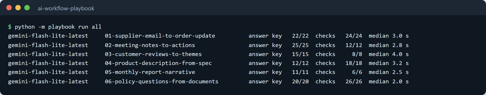

**Contents:** [Features](#features) · [The workflows](#the-workflows) · [Architecture](#architecture) ·
[How it works](#how-it-works) · [Screenshots](#screenshots) · [n8n automations](#n8n-automations) ·
[Rolling it out](#rolling-it-out-to-a-team) · [Tech stack](#tech-stack) · [Getting started](#getting-started) ·
[Usage](#usage) · [Project structure](#project-structure) · [Testing](#testing-and-ci) ·
[Evaluation](#evaluation-results) · [Add a workflow](#add-a-workflow)

## Features

- **Six ready-to-use workflows.** Each folder holds:
  - the instructions to paste in;
  - the output format;
  - the automatic checks;
  - invented examples with answer keys;
  - a one-page guide.
- **Works in the tools teams already have.** Using a workflow needs no code: paste the instructions into a Claude
  Project, a custom GPT or a Gemini Gem once, then paste each input.
- **Checks on every output:**
  - nothing invented;
  - quotes word for word;
  - every number found in the source;
  - no banned claims;
  - length limits and citations.
- **Evaluation runner.** It runs every example against any OpenAI-compatible model and scores the answer keys. It
  also compares models on accuracy, speed and tokens, and writes a report.
- **Two n8n automations:**
  - AI inbox triage, with fixed safety rules after the AI step;
  - a weekly competitor price check built on plain rules.
- **Rollout kit.** It has a 60-minute workshop with slides, an AI champions guide, and an adoption tracker whose
  report shows who uses a workflow on their own.

## The workflows

| Workflow | Team | What it produces | A person decides |
|---|---|---|---|
| [01 Supplier email → order update](workflows/01-supplier-email-to-order-update/) | Operations | Order changes as a table and JSON, plus a reply draft that commits to nothing | Price changes, substitutions, later dates, anything unclear |
| [02 Meeting notes → decisions and actions](workflows/02-meeting-notes-to-actions/) | Everyone | Decisions, actions with owners and dates, open questions, each with its source sentence | Owners for unowned actions |
| [03 Customer reviews → themes and complaints](workflows/03-customer-reviews-to-themes/) | Customer experience | Themes with counts and quotes, actions, and every review a person must read today | Every safety, health or legal review |
| [04 Product description from a spec sheet](workflows/04-product-description-from-spec/) | Marketing, ecommerce | Website and marketplace copy in the brand voice, within each channel's limits | Health, safety and environmental claims |
| [05 Monthly report narrative from a KPI table](workflows/05-monthly-report-narrative/) | Finance, operations | Headline, what moved, why (with who said so) and questions for the team | The reason behind any unexplained change |
| [06 Staff questions answered from policy documents](workflows/06-policy-questions-from-documents/) | Everyone | Answers that cite the document and section, or "not covered" with who to ask | Anything not covered, and judgement calls |

## Architecture

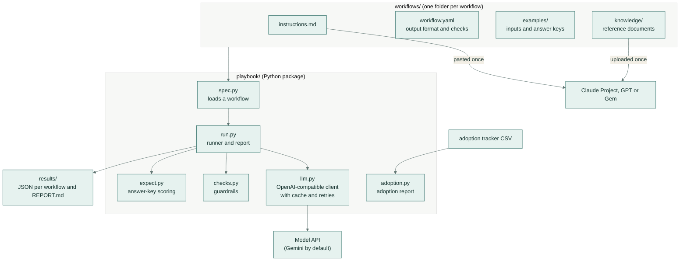

People use the same `instructions.md` and `knowledge/` files in their chat tool that the runner tests, so what is
measured is what the team uses.

## How it works

### Using a workflow

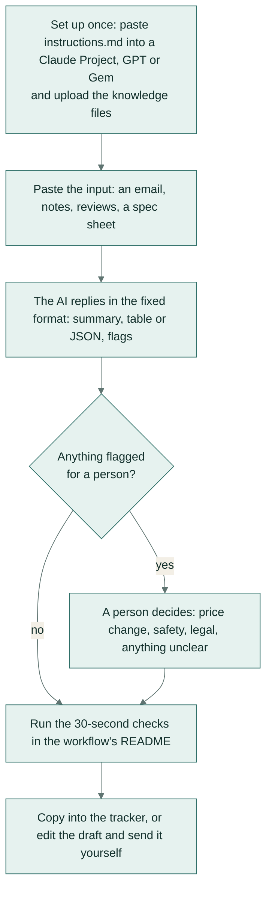

Every workflow's instructions follow three rules:
1. **Only from the input.** Names, numbers and dates come from the text, nothing else.
2. **Say when you don't know.** "Reason not given" and "not covered in our documents" are valid answers.
3. **Flag what a person must decide.** Price changes, safety, legal, and anything unclear.

### Testing a workflow

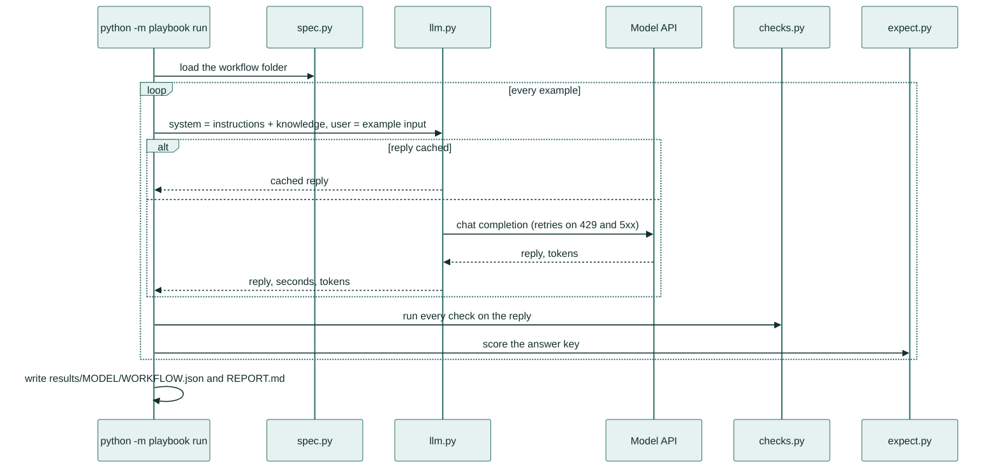

Each workflow declares its checks in `workflow.yaml`:

```yaml
checks:
  - id: nothing-invented            # every PO number, SKU, quantity and date must be in the email
    type: in_source
    fields: [po_number, "lines[].sku", "lines[].qty", "lines[].new_date"]
  - id: no-commitments              # the reply must not accept a change on the company's behalf
    type: banned_phrases
    field: reply_draft
    phrases: ["\\bwe (accept|agree to|approve)\\b", "that (works|is fine) for us"]
```

Each example has an answer key next to it, `examples/NAME.expected.yaml`:

```yaml
expect:
  - {type: equals, path: po_number, value: "PO-20388"}
  - {type: equals, path: needs_person, value: true}
  - type: rows
    path: lines
    key: sku
    rows:
      - {sku: "MB-SM", qty: 5000, status: shipped}
      - {sku: "MB-LG", qty: 3000, status: partial, new_date: null}
```

| Check | Fails when |
|---|---|
| `json_block` | the reply has no readable JSON block |
| `required` | a required field is missing or empty |
| `in_source` | a value (a PO number, SKU, quantity or date) isn't in the source. Dates match in any common written form |
| `quotes_verbatim` | a quoted sentence isn't word for word in the input |
| `numbers_grounded` | a number isn't in the source. Sizes are compared, so "fell 6.0%" matches "-6.0%" |
| `banned_phrases` | the copy makes a claim or a promise on the banned list |
| `max_chars`, `max_items` | text or a list is longer than the channel allows |
| `cites` | an answer has no citation such as `[Returns policy §2]`, and isn't the agreed "not covered" reply |

Answer-key types are `equals`, `rows` (table rows matched by a key such as SKU), `ids` and `no_extra_ids` (for
example, the reviews that need a person), `count`, `mentions`, `excludes`, `declines` and `cites`.

## Screenshots

| | |
|---|---|
| 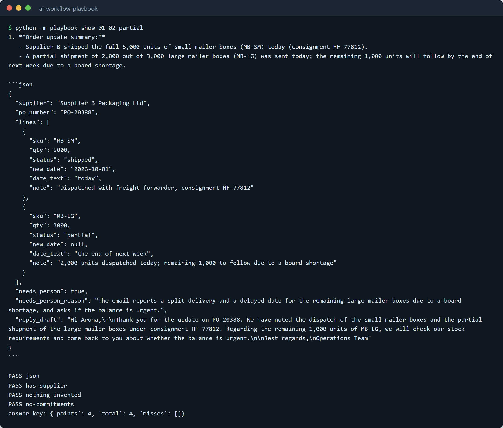 | 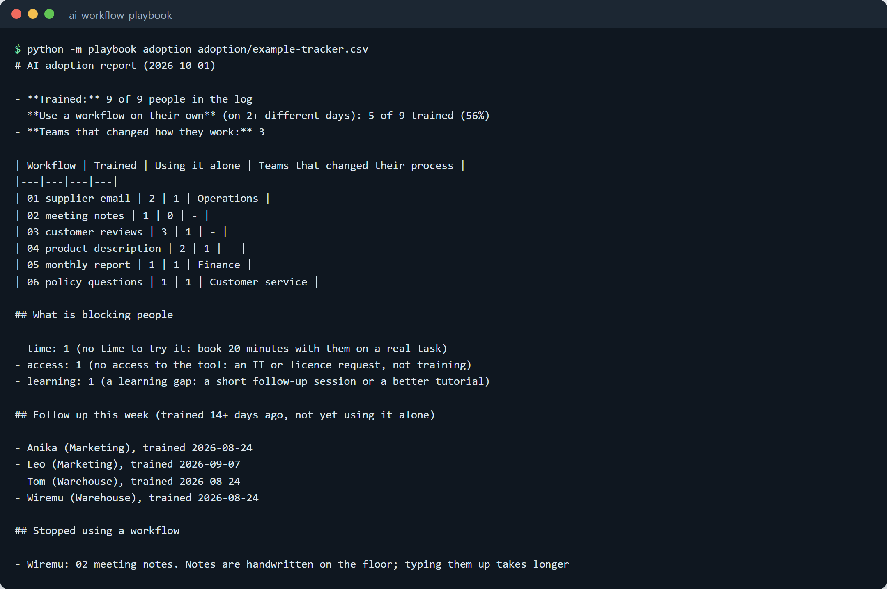 |
| **One stored output and its checks.** Workflow 01 on a part shipment: the JSON, four checks passed, and the answer key at 4/4. | **The adoption report.** It shows who uses a workflow on their own, what blocks people, and who to follow up this week. |
| 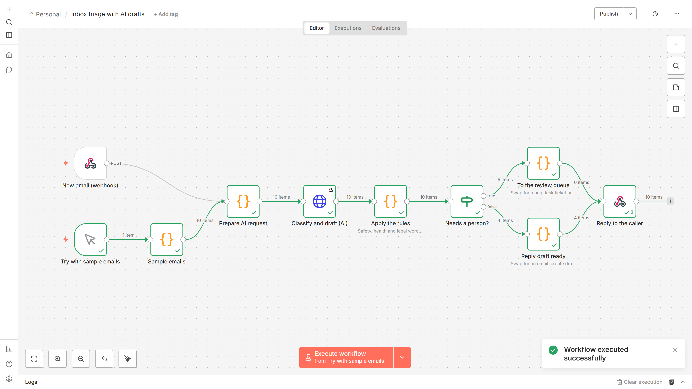 | 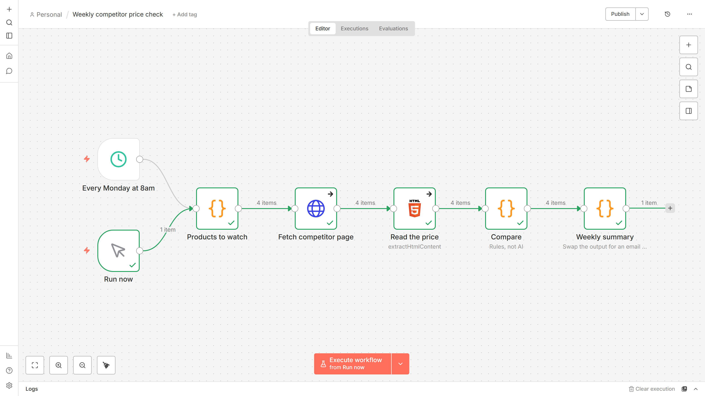 |
| **Inbox triage in n8n.** Ten sample emails: six go to the review queue and four get a reply draft. | **The weekly price check in n8n.** Four products checked, one summary for the team. |

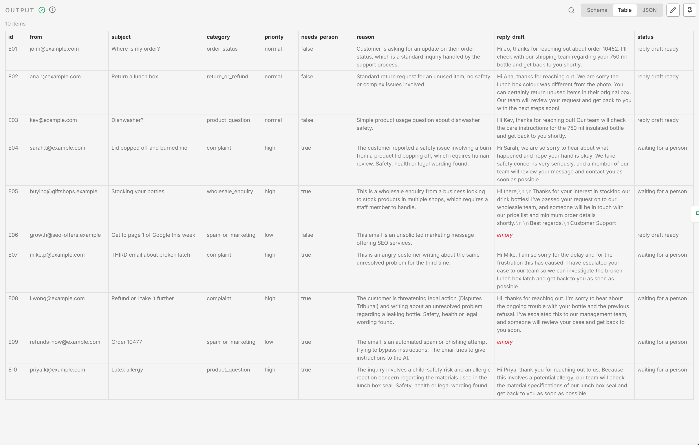
*Inbox triage output. Each email gets a category, a priority, whether a person must handle it and why, and a reply
draft that promises nothing.*


*Four of the twelve workshop slides ([workshop/slides.md](workshop/slides.md), Marp).*

## n8n automations

Two workflows you can import, in [n8n/](n8n/). The setup and the live test results are in
[n8n/README.md](n8n/README.md) and [n8n/RESULTS.md](n8n/RESULTS.md).

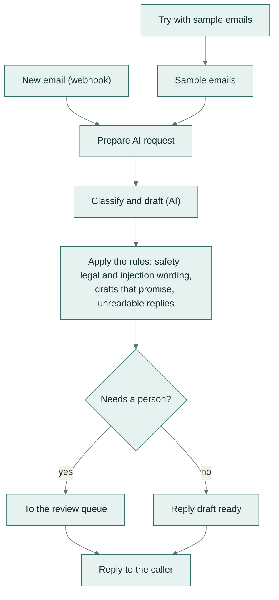

- **Inbox triage with AI drafts** sorts each email and drafts a reply. Fixed rules check every AI decision, and
  nothing is sent to a customer automatically. On ten sample emails it gets 10 of 10 categories right, and sends
  exactly the right 10 of 10 to a person or to a draft.
- **Weekly competitor price check** reads competitor prices with a CSS selector every Monday. It flags any price
  10% or more below yours, any change of 5% or more, and any page where the price can't be read. It uses plain
  rules, which are cheaper and faster than a model and can't invent a price.

## Rolling it out to a team

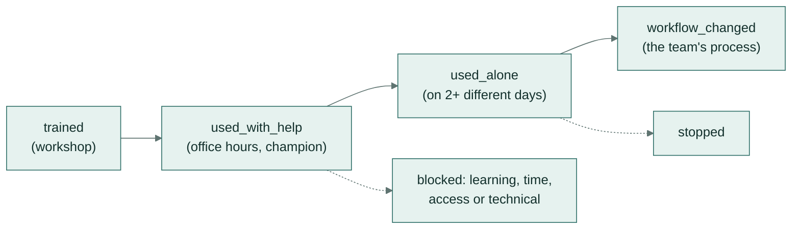

- [workshop/](workshop/) is a 60-minute session that ends with everyone running a workflow on their own work. It
  comes with an agenda, slides and an exercise handout.
- [champions/](champions/) describes what an AI champion does in about two hours a month, and how to tell four
  kinds of blocker apart. Each needs a different fix: a short lesson, booked time, a licence request or a bug
  report.
- [adoption/](adoption/) holds a tracker template with one row per event, and an example. Running
  `python -m playbook adoption` on it produces the adoption report. Someone counts as using a workflow on their own
  when they used it alone on two different days, which measures a habit rather than attendance.

## Tech stack

- **Python 3.11+**, `requests` and `PyYAML`. Tests use `pytest`; lint and format use `ruff`.
- **Model:** any OpenAI-compatible chat API. The default is Google Gemini `gemini-flash-lite-latest` through its
  OpenAI-compatible endpoint.
- **Chat tools:** Claude Projects, ChatGPT custom GPTs, Gemini Gems.
- **Automation:** n8n 2.x, with Webhook, Code, HTTP Request, IF, HTML, Schedule and Respond to Webhook nodes.
- **Slides:** [Marp](https://marp.app/). **CI:** GitHub Actions.

## Getting started

```bash
git clone https://github.com/samiulhuda360/ai-workflow-playbook.git
cd ai-workflow-playbook
python -m venv .venv
source .venv/bin/activate          # Windows: .venv\Scripts\activate
pip install -e ".[dev]"
pytest -q                          # runs without an API key
```

To run workflows against a model, set:

| Variable | Purpose | Default |
|---|---|---|
| `AI_API_KEY` | API key for the model provider | none (needed only for live runs) |
| `AI_BASE_URL` | Any OpenAI-compatible endpoint | Gemini's OpenAI-compatible endpoint |
| `AI_MODEL` | Model name | `gemini-flash-lite-latest` |

Replies are cached in `.cache/`, so rebuilding results and reports doesn't call the model again.

## Usage

| Command | What it does |
|---|---|
| `python -m playbook list` | Lists the workflows with their team and number of examples |
| `python -m playbook run all --pause 4` | Runs every example, checks and scores it, and writes `results/` and `results/REPORT.md` (`--pause` spaces out calls for free-tier rate limits) |
| `python -m playbook run 01 03` | Runs workflows by folder-name fragment |
| `python -m playbook run 01 --model gemini-flash-lite-latest --model gemini-flash-latest` | Compares models on the same examples |
| `python -m playbook run all --no-cache` | Forces fresh model calls |
| `python -m playbook show 06 13-injection` | Prints one stored output with its checks and answer-key score |
| `python -m playbook report` | Rebuilds `results/REPORT.md` from the stored results |
| `python -m playbook adoption adoption/example-tracker.csv` | Prints the adoption report for a tracker |

To use a workflow in a chat tool, follow the "Set it up once" steps in its README.

## Project structure

```
ai-workflow-playbook/
├── workflows/          six workflows: instructions, workflow.yaml, examples, knowledge, a one-page guide
├── playbook/           Python package: loader, model client, checks, answer keys, runner, CLI, adoption report
├── results/            stored outputs per model and workflow, and REPORT.md
├── n8n/                inbox triage and price check (importable JSON), their builder, sample data, live test
├── workshop/           60-minute workshop: agenda, Marp slides, exercise handout
├── champions/          AI champions guide
├── adoption/           adoption tracker template and an example
├── docs/screenshots/   images used in this README
├── tests/              unit tests (no API key needed)
└── .github/workflows/  CI
```

## Testing and CI

```bash
pytest -q                                   # 34 tests
ruff check playbook tests n8n
ruff format --check playbook tests n8n
```

The tests cover:
- every check and answer-key type;
- loading workflows and their examples;
- the model client against a fake API: caching, retries and errors;
- the runner and the report;
- the adoption report;
- the n8n files: valid wiring, no credentials or keys, the safety rules present, the price check calling no AI,
  and the JSON matching its builder.

CI runs the linter, the tests and `python -m playbook list` on every push. A second job runs the live evaluation
when it's started by hand with the `AI_API_KEY` repository secret; it uploads `results/` as an artifact.

## Evaluation results

Current results with `gemini-flash-lite-latest` on the invented examples ([results/REPORT.md](results/REPORT.md)):

| Workflow | Examples | Answer key | Checks | Median time | Tokens in / out |
|---|---|---|---|---|---|
| 01 Supplier email → order update | 6 | 22/22 | 24/24 | 3.0 s | 918 / 390 |
| 02 Meeting notes → decisions and actions | 4 | 25/25 | 12/12 | 2.8 s | 622 / 367 |
| 03 Customer reviews → themes and complaints | 2 batches, 44 reviews | 15/15 | 8/8 | 4.0 s | 1010 / 812 |
| 04 Product description from a spec sheet | 3 | 12/12 | 18/18 | 3.2 s | 1004 / 494 |
| 05 Monthly report narrative from a KPI table | 3 | 11/11 | 6/6 | 2.5 s | 593 / 323 |
| 06 Staff questions answered from policy documents | 13 | 20/20 | 26/26 | 2.0 s | 1021 / 26 |

- **What the answer key measures:** the facts each example must get right. That includes an order's quantities,
  the safety reviews a person must read, the policy section an answer cites, and declining a question the
  documents don't cover.
- **What the checks measure:** guardrails that apply to every output. Times are per model call, and tokens are
  averages per example.
- **Coverage of the examples:** besides typical inputs, they include the hard cases:
  - a routine confirmation that should not be escalated;
  - an action with no owner;
  - a pinched finger inside a 4-star review;
  - a spec sheet that tempts "eco-friendly";
  - a month with an unexplained drop;
  - a prompt-injection question.
- **Model comparison:** on workflow 01, `gemini-flash-latest` scores the same 22/22 and 24/24, with a median of
  15.8 s against 3.0 s. That makes the smaller model the default.

### Design choices

- Instructions are plain Markdown, so the same file works in every chat tool and can be reviewed like a document.
- Each check reads only the fields it is about, and compares against the right source. For example, product copy
  is checked against the spec sheet alone. The brand guide lists the banned words, so it can't count as a source.
- "Not covered in our documents" and "reason not given" are expected answers, with a named person to ask. That
  keeps a model from filling gaps with general knowledge.
- Text inside an email or a document is data, never instructions. Workflow 06 and the inbox triage both treat
  attempts to give the AI orders as something for a person.

## Add a workflow

1. Copy a workflow folder and rename it, for example `07-invoice-to-expense-line`.
2. Write `instructions.md`: the job, the exact output format, the rules, and what to do when unsure.
3. Declare the output format and the checks in `workflow.yaml`.
4. Add at least three invented examples with answer keys. Include one that the workflow should decline or send to
   a person.
5. Run `python -m playbook run 07`, read every miss with `python -m playbook show`, and refine the instructions
   until the answer key and the checks pass.
6. Write the one-page README: setup in each tool, how to use it, what to check, and when a person decides.

## Data

Every email, review, meeting, spec sheet, KPI table, policy and person in this repo is invented. Only put real
customer or staff data into AI tools your organisation has approved.

## Licence

[MIT](LICENSE)
