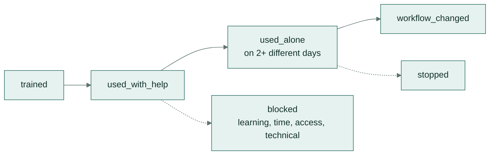

# Adoption tracker

Counting who attended training is easy, but it says little. This tracker and its report answer the questions an
AI adoption lead gets asked:
- Who now uses a workflow without help?
- Which teams changed how they work?
- What is blocking the rest?
- Who should be followed up this week?


## How it works



1. Champions and the workshop facilitator log one row per event in a CSV, which can be a shared spreadsheet
   exported to CSV.
2. `python -m playbook adoption tracker.csv` reads the log and prints the report.
3. Someone counts as **using a workflow on their own** once they have used it alone on two different days. That
   measures a habit, not a single try.
4. Anyone trained 14 or more days ago who isn't yet using it alone appears on the **follow up this week** list.
5. Blockers are counted by kind, because each kind needs a different fix: see the
   [champions guide](../champions/README.md).

## The log format

[tracker-template.csv](tracker-template.csv) has one header row:

```
date,person,team,workflow,event,notes
```

| Column | What goes in it |
|---|---|
| `date` | The day it happened, as `YYYY-MM-DD` |
| `person`, `team` | Who it was, and their team |
| `workflow` | Which workflow, for example `01 supplier email` |
| `event` | `trained`, `used_with_help`, `used_alone`, `workflow_changed`, `blocked` or `stopped` |
| `notes` | For `blocked`, the kind first: `learning`, `time`, `access` or `technical`. Free text otherwise |

An unknown event name stops the report with the line number, so typos don't quietly skew the numbers.

## Try it

```bash
python -m playbook adoption adoption/example-tracker.csv
```

[example-tracker.csv](example-tracker.csv) is an invented log for nine people over about five weeks. The report
shows:
- 5 of 9 trained people using a workflow on their own (56%);
- 3 teams that changed a process;
- one blocker each for time, access and learning;
- four people to follow up.
