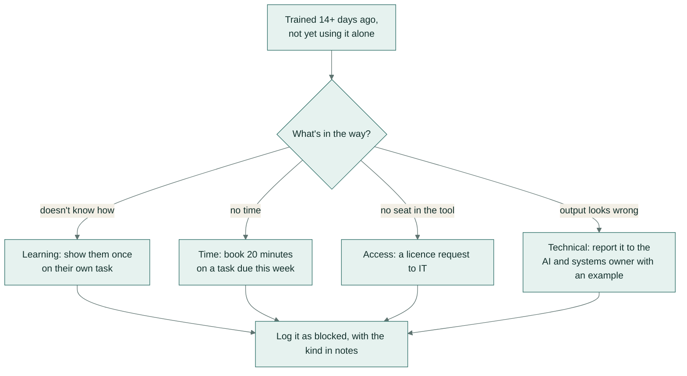

# AI champions guide

**In plain words:** a short guide for the colleague in each team who helps others get started with AI: what they do
each week and month, and how to tell why someone has stopped using it, so the right fix is applied.

A champion is someone in a team who uses AI workflows well and helps the people around them do the same. About
two hours a month. Champions are not IT support and not the AI police: they make it easy to start and safe to
keep going.

## What a champion does

| Every week | Every month |
|---|---|
| Answers "how do I..." questions from their team | Hosts a 15-minute show-and-tell: one workflow, one result, one check that caught something |
| Sits with one person for 20 minutes on a real task | Sends the adoption lead the team's new workflow ideas |
| Logs what happened in the adoption tracker | Retires or updates a workflow that stopped working |

## Helping someone who is stuck

First work out which kind of problem it is. Each has a different fix:

| Problem | Sounds like | What helps |
|---|---|---|
| Learning | "I don't know how to export the reviews with IDs." | Show them once on their own task; point to the guide |
| Time | "I'll try it after the campaign." | Book 20 minutes now on a task due this week |
| Access | "I don't have a seat in the tool." | A licence request to IT, not more training |
| Technical | "It used to work, now the output is wrong." | Report it to the AI & systems owner with an example |

Log it as `blocked` with the kind in the notes, so the report shows what is really holding people back.

## Sharing a new workflow

Before a workflow is shared beyond one person, it needs the same parts as the ones in this playbook:

1. **Instructions** with a fixed output format.
2. **Rules** for what it must not invent, and when a person decides.
3. **Three real examples** run through it, with what you checked.
4. **The checks** a user makes before trusting it (30 seconds or less).
5. **An owner** who updates it when the tool or the process changes.

Copy any workflow folder in [workflows/](../workflows/) as a starting point.

## Guardrails champions hold the line on

- Only approved tools; never customer or staff personal details in anything else.
- Every output is checked by the person who sends or uses it.
- Safety, health, legal and money decisions stay with a person, whatever the output says.
- If a workflow makes things slower (it happens: handwritten notes take longer to type up than to action), say
  so and stop using it. Log it as `stopped` with the reason; that's useful too.

## When to call the AI & systems owner

Anything that needs a connection to another system (email, ERP, the online store, accounting), runs on a schedule, or touches
personal data at scale. Those become automations like the two n8n workflows in this playbook, built and owned
centrally.
