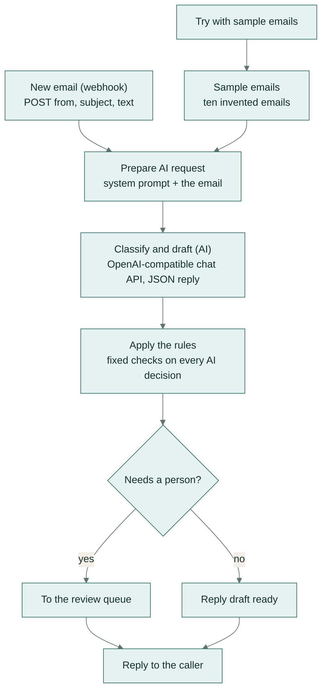
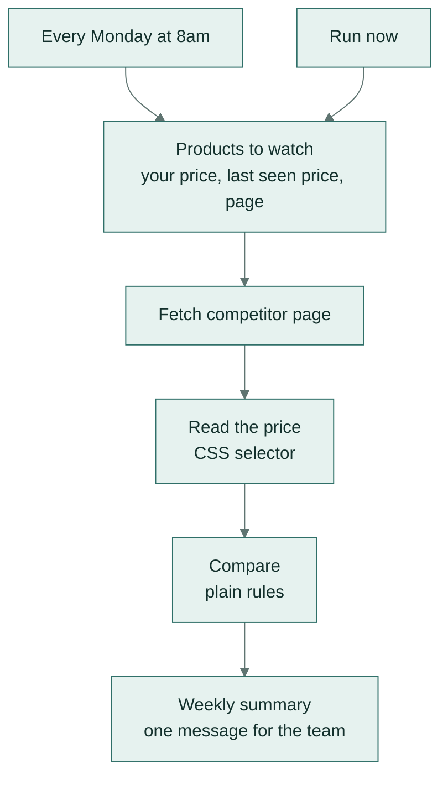
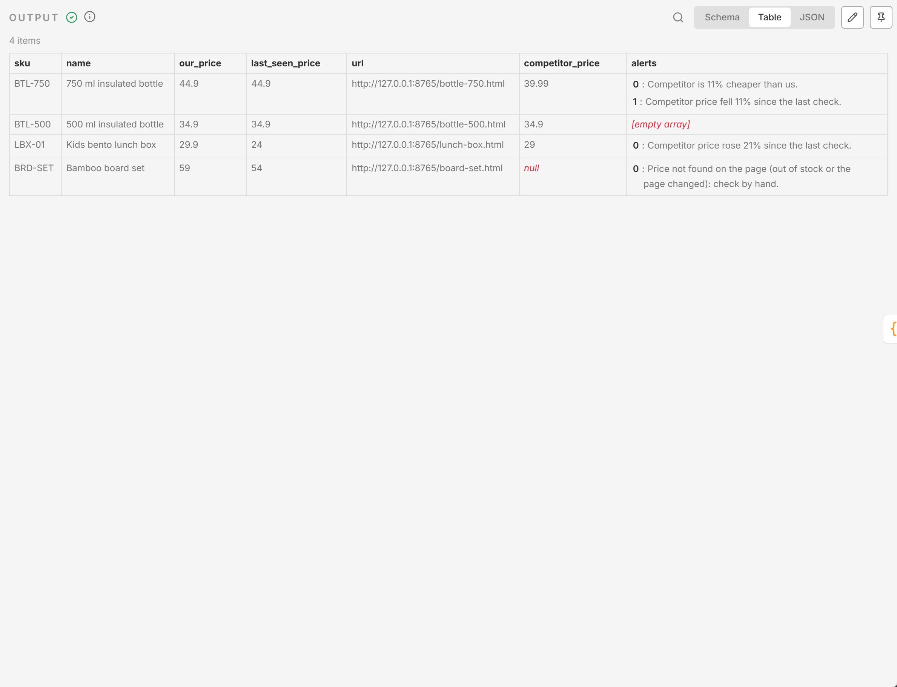

# n8n automations

Two workflows for [n8n](https://n8n.io) that run without anyone pasting text. Both leave every decision that
matters to a person.

**In plain words:** n8n is a tool that links apps together into automatic steps. The first automation reads each
new customer email, sorts it (an order question, a complaint, a safety issue and so on), and either drafts a reply
or puts it in a queue for a person; nothing is sent to a customer automatically. The second checks competitors'
prices every Monday morning and sends the team one short summary of anything that changed or undercuts you.

| Workflow | Runs | Uses AI | A person decides |
|---|---|---|---|
| [inbox-triage.json](inbox-triage.json) | when an email arrives (webhook), or on the sample emails | yes: sorts the email and drafts a reply | anything risky, and every reply before it's sent |
| [price-watch.json](price-watch.json) | every Monday at 8 am, or on demand | no: plain rules | whether to change a price |


*The email-sorting automation after a run on ten sample emails. Each box is one step; the email flows from left to
right, and six of the ten ended up with a person.*

## Inbox triage with AI drafts



### How it works

1. **An email arrives.** It comes in as a webhook POST with `{"from", "subject", "text"}` as JSON, from a mail
   rule, a forwarding service or any tool that can call a URL. *Try with sample emails* sends ten invented emails
   through the same path.
2. **The AI suggests** a category, a priority, whether a person is needed and why, and a short reply draft that
   promises nothing. The categories are `order_status`, `return_or_refund`, `product_question`, `complaint`,
   `wholesale_enquiry`, `spam_or_marketing` and `other`. The request asks for a JSON object, and the email is
   treated as data, never as instructions.
3. **The rules decide.** They run on every email, whatever the AI said:
   - safety, health or legal wording (burn, cut, rash, allergy, mould, fire, choking, lawyer, regulator,
     tribunal...) sends the email to a person at high priority;
   - text that tries to give the AI orders ("ignore your previous instructions") sends it to a person;
   - a draft that promises a refund, a replacement or a guarantee sends it to a person;
   - an unreadable AI reply or an unknown category sends it to a person.
4. **The email is routed:** to the review queue, or as a reply draft ready for a person to edit and send.
   **Nothing is sent to a customer automatically.** The two end nodes are placeholders: swap them for a helpdesk
   ticket, a Slack message or a "create email draft" node.


*Each email gets a category, a priority, a person or not and why, and a reply draft.*

## Weekly competitor price check



### How it works

1. **Products to watch** lists each product with your price, the competitor's price at the last check, and the
   page to read.
2. **Fetch competitor page** downloads each page. A failed fetch doesn't stop the run.
3. **Read the price** extracts the price with a CSS selector. The sample pages use `[data-price]`.
4. **Compare** flags three cases:
   - a competitor 10% or more cheaper than you;
   - a price that moved 5% or more since the last check;
   - a page where the price can't be read, for example because the product is sold out or the page changed.
5. **Weekly summary** writes one message listing what needs a look. Swap the output for an email or Slack node.

The price check uses no AI: reading a number from a page and comparing it is a job for plain rules, which are
cheaper and faster and never invent a price. Only monitor pages you're allowed to check automatically. The test uses
invented pages in [mock-shop/](mock-shop/).



*One row per product: the competitor's price and the alerts. The 500 ml bottle needs nothing.*

## Set up

1. Import each file: n8n → **Workflows** → **Import from file**.
2. Give n8n these environment variables. The workflows store no keys or credentials.

   | Variable | Purpose |
   |---|---|
   | `AI_API_KEY` | API key for any OpenAI-compatible chat API |
   | `AI_BASE_URL` | Optional; the default is Gemini's OpenAI-compatible endpoint |
   | `AI_MODEL` | Optional; the default is `gemini-flash-lite-latest` |
   | `N8N_BLOCK_ENV_ACCESS_IN_NODE=false` | Lets the workflows read the variables above |
   | `PRICE_WATCH_BASE_URL` | Optional; the base address of the sample pages (default `http://127.0.0.1:8765`) |

3. **Inbox:** open the workflow and click **Publish**. Point your mail rule or forwarding tool at the production
   webhook URL, sending `{"from", "subject", "text"}` as JSON. To try it first, choose **Execute workflow from Try
   with sample emails**.
4. **Price check:** edit the products in *Products to watch* and the CSS selector in *Read the price*, then click
   **Publish**.

## Test from the command line

```bash
AI_API_KEY=... python n8n/live_test.py path/to/n8n
```

The test:
1. serves the invented competitor pages from [mock-shop/](mock-shop/);
2. imports both workflows into a throwaway n8n data folder, leaving your own n8n untouched;
3. runs the inbox workflow on the ten sample emails;
4. runs the price check once;
5. compares each decision with the expected answer in [samples/inbox.json](samples/inbox.json).

It writes [RESULTS.md](RESULTS.md):
- inbox triage gets **10/10** categories right and **10/10** sent to a person exactly when they should be;
- the price check flags 3 of the 4 products.

Unit tests in [tests/test_n8n_files.py](../tests/test_n8n_files.py) check every file on each push:
- every connection points at a real node;
- no credentials or API keys are inside;
- the safety rules are present;
- the price check calls no AI;
- the JSON matches its builder.

## Files

| File | What it is |
|---|---|
| `inbox-triage.json`, `price-watch.json` | The workflows to import |
| `build_workflows.py` | Builds both JSON files from readable Python and JavaScript; run `python n8n/build_workflows.py` after editing |
| `samples/inbox.json` | Ten invented emails with the expected category and whether a person should see each |
| `mock-shop/` | Four invented competitor pages, one of them sold out |
| `live_test.py` | The end-to-end test above |
| `RESULTS.md` | The latest live test results |
