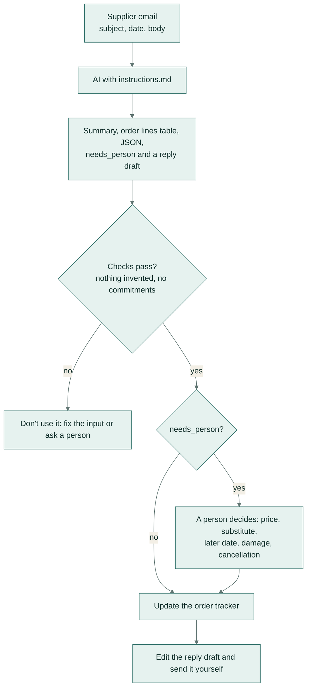

# Supplier email → order update

**Team:** operations · **Pattern:** extract, verify, draft · **Works in:** Claude Projects, ChatGPT GPTs,
Gemini Gems

Suppliers write about orders in every style: delays, part shipments, price rises, substitutions. This turns one
email into the order changes, a flag when a person must decide, and a reply draft that doesn't commit you to
anything.

## How it works

The output has four parts:
- a three-line summary;
- a table of order lines with SKU, quantity, status, the date the email gives, and a note;
- the same data as JSON for the tracker;
- a reply draft.

`needs_person` is true when something already agreed changes, and its reason says which.

## Set it up once (5 minutes)

| Tool | Where the instructions go |
|---|---|
| Claude | New Project "Supplier updates" → *Project instructions* → paste [instructions.md](instructions.md) |
| ChatGPT | Explore GPTs → Create → *Configure* → *Instructions* → paste |
| Gemini | Gems → New Gem → *Instructions* → paste |

## Use it

1. Paste the whole email, including the subject line and date.
2. Read the three-line summary.
3. Copy the table or JSON into the order tracker.
4. Edit the reply draft and send it yourself.

## Check before you trust it (30 seconds)

- The PO number, SKUs and quantities match the email. This is tested automatically on every example: no value in
  the output may be missing from the email.
- Anything marked **needs a person**: decide it yourself, don't just forward it.
- The reply doesn't accept a price, product or date change. This is also tested automatically.

## When a person must decide

Price changes, substitutions, later dates, damage or quality problems, cancellations, and anything the email
leaves unclear ("end of next week").

## Design notes

- `new_date` holds any date the email gives. For a part shipment, it is the date for the part still to come; what
  has already shipped goes in `note`.
- A routine confirmation of what was agreed doesn't need a person. That keeps the flag meaningful.
- The reply draft says the team will check and come back. It never accepts a change, because accepting one is a
  commercial decision.

## Tested on

Six invented supplier emails: a delay, a part shipment, a price rise, a colour substitution, a routine
confirmation, and a trade-fair invitation that isn't about an order.

| Model | Answer key | Checks | Median time |
|---|---|---|---|
| `gemini-flash-lite-latest` | 22/22 | 24/24 | 3.0 s |
| `gemini-flash-latest` | 22/22 | 24/24 | 15.8 s |

Full results: [results/REPORT.md](../../results/REPORT.md). Rerun with `python -m playbook run 01`.
