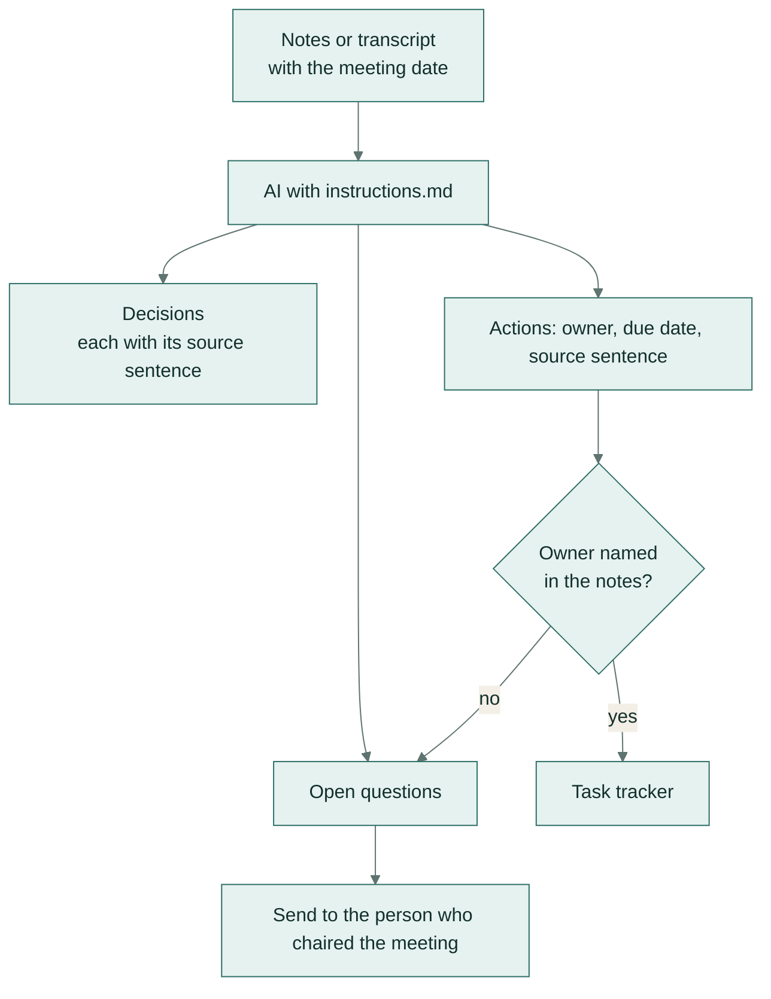

# Meeting notes → decisions and actions

**Team:** everyone · **Pattern:** summarise with traceability · **Works in:** Claude Projects, ChatGPT GPTs,
Gemini Gems

Turns rough notes or a meeting transcript into decisions, actions with owners and dates, and open questions.
Every decision and action carries the exact sentence it came from, so nobody has to trust the summary blindly.

## How it works

## Set it up once

Paste [instructions.md](instructions.md) into a Claude Project, a ChatGPT GPT or a Gemini Gem. See
[workflow 01](../01-supplier-email-to-order-update/) for where each tool keeps instructions.

## Use it

1. Paste the notes or transcript, with the meeting date at the top.
2. Read the summary; copy the actions into your task tracker.
3. Send the open questions to the person who chaired the meeting.

## Check before you trust it

- Each action's **source** sentence is really in the notes (search for it). Tested automatically.
- Owners and dates appear in the notes. The AI must not assign work or invent deadlines. Tested automatically.
- An action with no owner is listed as an open question, not silently dropped.

## When a person must decide

Who owns an unowned action, and whether a decision reversed later in the meeting is final.

## Design notes

- Source sentences are copied character for character, and a name is never swapped inside a quote. The
  `quotes_verbatim` check enforces this.
- A weekday stays a weekday. "By Monday" is never turned into a calendar date the notes don't give.
- When a meeting reverses a decision, only the final decision is listed.

## Tested on

Four invented meetings: bullet-point notes, a spoken transcript, messy notes with an action nobody took, and a
meeting that reversed its own decision.

| Model | Answer key | Checks | Median time |
|---|---|---|---|
| `gemini-flash-lite-latest` | 25/25 | 12/12 | 2.8 s |

Full results: [results/REPORT.md](../../results/REPORT.md). Rerun with `python -m playbook run 02`.
