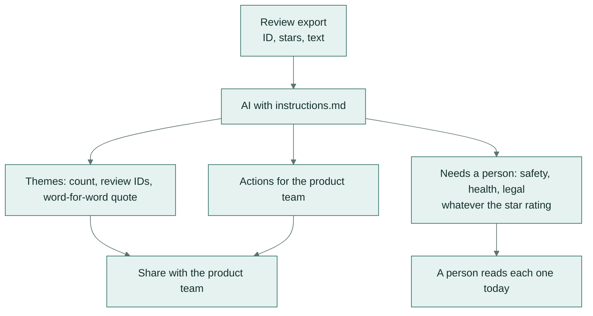

# Customer reviews → themes and complaints

**Team:** customer experience, marketing · **Pattern:** classify at scale, escalate to a person ·
**Works in:** Claude Projects, ChatGPT GPTs, Gemini Gems

Reads a month of reviews and returns:
- the themes, each with a count, the review IDs and a real quote;
- practical actions;
- every review a person must read today: injuries, allergic reactions, contamination, child safety and legal
  threats.

**In plain words:** paste in a month of customer reviews and you get back what people keep praising or complaining
about, with real quotes, plus a short list of reviews someone must read today. A pinched finger mentioned in a
four-star review still makes that list.

## How it works

## Set it up once

Paste [instructions.md](instructions.md) into a Claude Project, ChatGPT GPT or Gemini Gem.

## Use it

1. Export the month's reviews with an ID, the star rating and the text, one per line.
2. Paste them in. For more than about 200 reviews, split them into batches.
3. **Read every review in "needs a person" yourself, today.**
4. Share the themes and actions with the product team.

## Check before you trust it

- Every review in "needs a person" is a real review ID from your export. Tested automatically.
- Quotes are word for word. Tested automatically: a reworded quote fails.
- Spot-check one theme: open two of its review IDs and confirm they belong there.

## When a person must decide

Every safety, health or legal review. The AI's job is to make sure none is missed, not to answer them.

## Design notes

- The safety rule reads: "every review that mentions an injury... even if it's only one review and even if the
  rating is high". A summary of sentiment would otherwise bury one serious complaint inside a positive theme.
- Ordinary complaints (late delivery, wrong colour, price) stay in the themes and are not flagged. That keeps the
  "needs a person" list short enough to read every day.

## Tested on

Two invented batches: 24 drink-bottle reviews and 20 lunch-box reviews. Both contain planted safety reviews:
- a burn;
- a cut lip;
- mould;
- a rash;
- children feeling sick;
- a threat to report the company to the regulator;
- a pinched finger hidden inside a **4-star** review.

| Model | Answer key | Checks | Median time |
|---|---|---|---|
| `gemini-flash-lite-latest` | 15/15 | 8/8 | 4.0 s |

The answer key requires every planted safety review to be flagged, and no ordinary complaint. Full results:
[results/REPORT.md](../../results/REPORT.md). Rerun with `python -m playbook run 03`.
