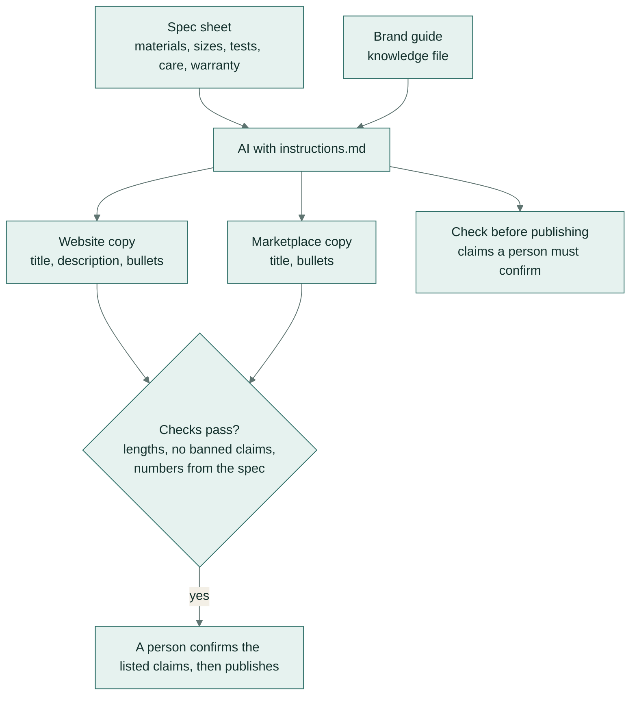

# Product description from a spec sheet

**Team:** marketing, ecommerce · **Pattern:** generate within rules · **Works in:** Claude Projects, ChatGPT
GPTs, Gemini Gems (with the brand guide uploaded as a knowledge file)

Writes website and marketplace copy from a product spec sheet in the brand's voice. The copy stays within each
channel's length limits and makes no claims the business can't support, such as "non-toxic", "eco-friendly" or
"best".

## How it works

## Set it up once

1. Paste [instructions.md](instructions.md) into the project's instructions.
2. Upload [knowledge/brand-guide.md](knowledge/brand-guide.md) as a knowledge file. Keep one copy of the brand
   guide and update it there; every project that uses it gets the change.

## Use it

1. Paste the spec sheet (materials, sizes, test reports, care, warranty).
2. Read the "check before publishing" list first.
3. Paste the copy into the website and marketplace listing, then read it once more in place.

## Check before you trust it

- Length limits per channel. Tested automatically. The website title has 70 characters, the description 600, a
  bullet 150; the marketplace title has 200 and a bullet 250; each list has at most five bullets.
- No banned words or claims in the copy. Tested automatically.
- Every number (sizes, hours, warranty) is in this product's spec sheet. Tested automatically.
- Certificates are quoted with who tested them, for example "BPA-free (tested by an accredited lab)".

## When a person must decide

Any claim about health, safety or the environment, and anything on the "check before publishing" list.

## Design notes

- The banned-claims check reads only the copy fields, not the AI's notes, and allows a claim only when the spec
  sheet itself makes it. The brand guide lists the banned words, so it never counts as a source.
- The numbers check compares against the spec sheet alone. That way a warranty mentioned only in the brand guide
  can't appear in a product's copy.

## Tested on

Three invented spec sheets:
- an insulated bottle;
- a bamboo board set, which tempts "eco-friendly";
- a kids' lunch box, which tempts "non-toxic" and "healthy".

| Model | Answer key | Checks | Median time |
|---|---|---|---|
| `gemini-flash-lite-latest` | 12/12 | 18/18 | 3.2 s |

Full results: [results/REPORT.md](../../results/REPORT.md). Rerun with `python -m playbook run 04`.
