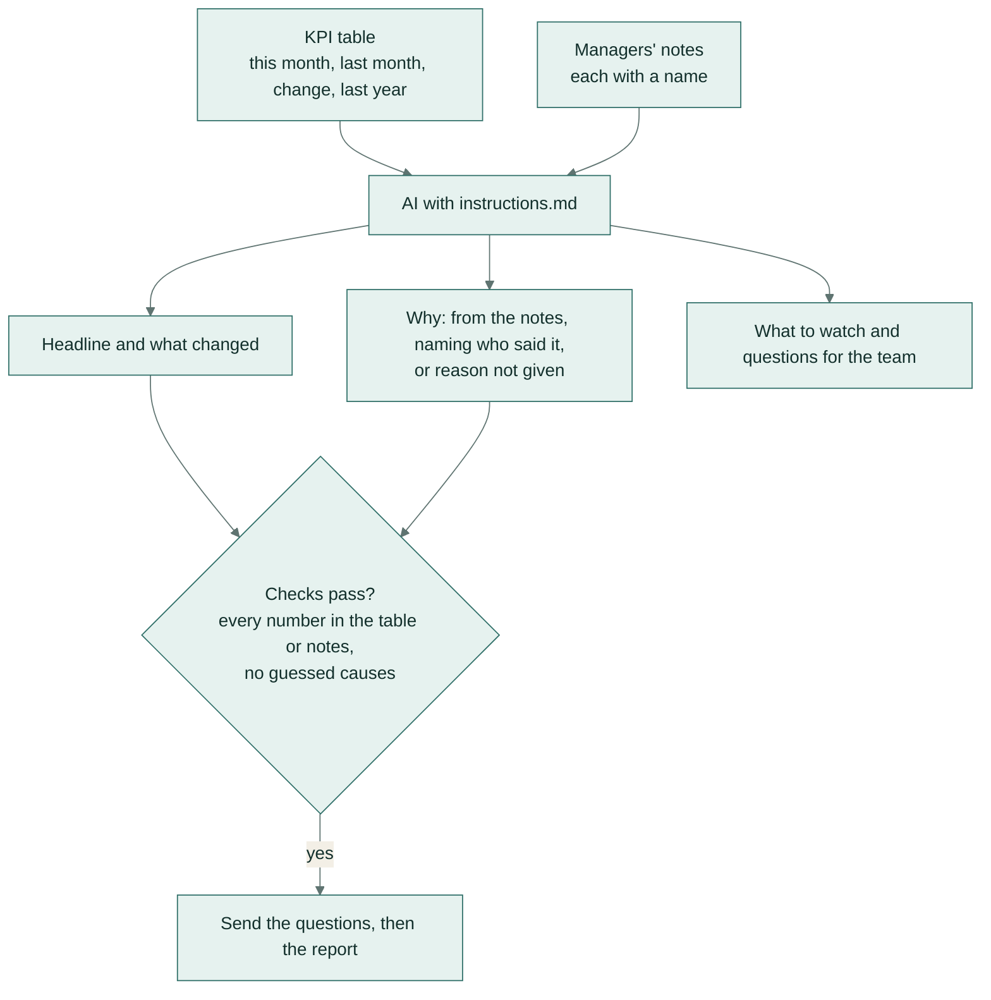

# Monthly report narrative from a KPI table

**Team:** finance, operations · **Pattern:** write around the numbers, never invent them ·
**Works in:** Claude Projects, ChatGPT GPTs, Gemini Gems

Turns the month's KPI table and the managers' notes into leadership commentary: headline, what changed, why,
what to watch, and questions for the team. It writes "reason not given" when the notes don't explain a change,
instead of guessing one.

**In plain words:** paste in this month's key figures (sales, costs, orders and so on) and the managers' comments,
and you get back the written commentary for the monthly report. If sales dropped and nobody explained why, it says
so and asks the question, rather than inventing a reason.

## How it works

## Set it up once

Paste [instructions.md](instructions.md) into a Claude Project, ChatGPT GPT or Gemini Gem.

## Use it

1. Paste the KPI table, with this month, last month, the change and the same month last year.
2. Paste the managers' notes below it, each with the person's name.
3. Send the "questions for the team" before you send the report.

## Check before you trust it

- Every number in the commentary is in the table or the notes. Tested automatically.
- No guessing words ("likely due to", "probably because"). Tested automatically.
- Each "why" names the person whose note it came from.

## When a person must decide

The real reason behind any change marked "reason not given".

## Design notes

- The numbers check compares the size of each number and leaves the direction to the words. "Online revenue fell
  6.0%" therefore matches a table that says "-6.0%".
- Small counting numbers (up to 5) are allowed, so "three of the five regions" reads naturally.

## Tested on

Three invented months:
- a busy month with an unexplained jump in returns;
- a month where online sales fell 6% and nobody explained why;
- a quiet month that should be reported as steady.

| Model | Answer key | Checks | Median time |
|---|---|---|---|
| `gemini-flash-lite-latest` | 11/11 | 6/6 | 2.5 s |

Full results: [results/REPORT.md](../../results/REPORT.md). Rerun with `python -m playbook run 05`.
