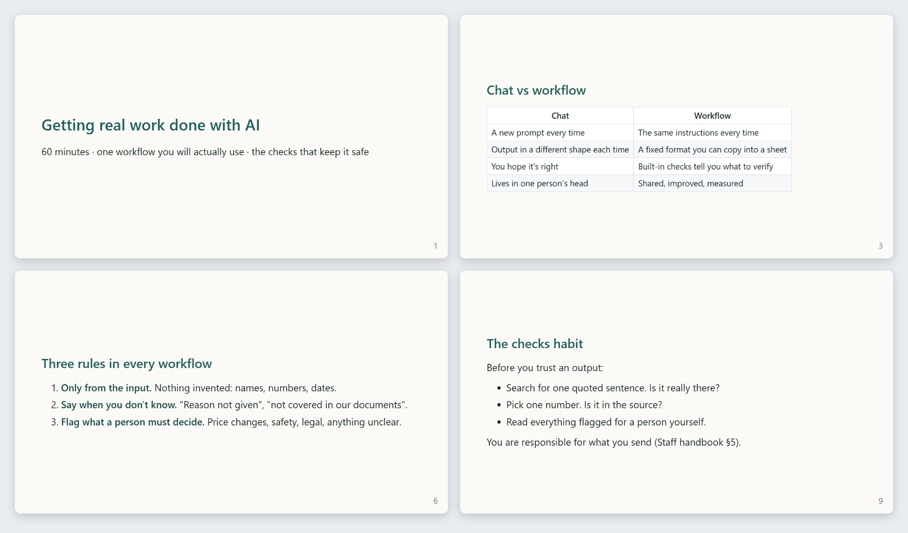
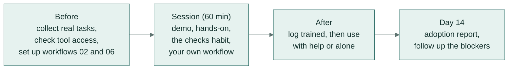

# Workshop: getting real work done with AI (60 minutes)

**In plain words:** a one-hour session that takes a team from "we try AI chat sometimes" to each person having one
AI workflow set up for a job they do every week, and knowing what to check before trusting the answer.

For a team of up to 12 who use AI chat now and then but don't yet have workflows they repeat. Run it in person or
on a call with screens shared. Everyone needs a seat in an approved AI tool before the session (check access the
week before: missing access is the commonest reason people never start).

**Goal:** everyone leaves with one workflow set up for a task they do every week, has run it on their own work,
and knows the checks they must make before trusting the output.

*Four of the twelve workshop slides: the title, why a workflow beats one-off chat requests, the three rules every
workflow follows, and the checks to make before trusting an answer.*

## Before the session

- Ask each person for one repetitive task they did last week and how long it took. Pick the workshop examples
  from those tasks.
- Set up a shared project (Claude Project, custom GPT or Gem) with [workflow 02](../workflows/02-meeting-notes-to-actions/)
  and [workflow 06](../workflows/06-policy-questions-from-documents/) so nobody waits on setup.
- Print or share the [exercise handout](exercise.md).

## Agenda

| Minutes | What | How |
|---|---|---|
| 0-5 | Why we're here | One real task from the team, timed. "We'll get this to 5 minutes, with checks." |
| 5-15 | What AI does well, and where it needs a check | Slides 3-6. Show one output next to its automatic checks (`python -m playbook show 01 02-partial`). |
| 15-25 | Demo: a workflow, not a chat | Live: meeting notes → actions (workflow 02). Point at the instructions, the fixed output format, the source quotes. |
| 25-45 | Hands-on | Exercise 1 (everyone), then exercise 2 or 3 (choose). Facilitator and champions walk the room. |
| 45-52 | The checks habit | Each person shows one check they made and what it caught. |
| 52-58 | Your workflow | Each person writes down one weekly task and books 20 minutes this week to set it up (exercise 4). |
| 58-60 | How to get help | Office hours, the champions, the playbook link. |

## After the session

- Log attendance as `trained` in the [adoption tracker](../adoption/tracker-template.csv).
- At office hours in the next two weeks, log `used_with_help` or `used_alone`.
- Run `python -m playbook adoption <tracker.csv>` after two weeks and follow up with everyone on the list.
  Ask what got in the way and log it as learning, time, access or technical. Each needs a different fix.

## Slides

[slides.md](slides.md) is written for [Marp](https://marp.app/) (VS Code extension or
`npx @marp-team/marp-cli slides.md --pdf`), and reads fine as plain Markdown.
